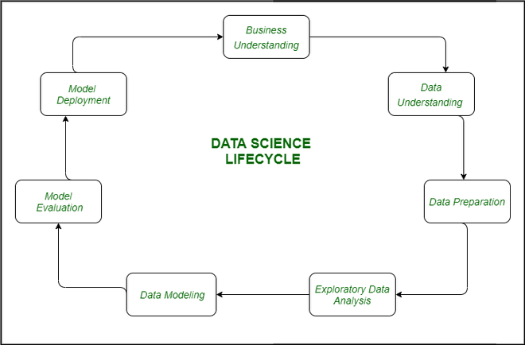

# Health Insurance Lead Prediction

## Project Introduction

In this project, we applied multiple machine learning models (including random forest, XGBoost, and a simple neural network) to a classification task.

The project includes necessay steps for a complete data science lifecycle, from Data understanding to model evaluation.



### [Dataset Overview](https://www.kaggle.com/datasets/klmsathishkumar/health-insurance-lead-prediction)

The dataset comprises demographic and policy-related information of customers, which includes:
- **City**: Code for the city of the customers
- **Age**: Maximum and minimum age of the customer (captured as `Upper_Age` and `Lower_Age`)
- **Current Insurance Holdings**: Information regarding any existing insurance policies the customer holds
- **Recommended Health Insurance Plans**: Details about the health insurance plans recommended to them

## Models Used
1. **XGBoost**: An optimized gradient boosting algorithm that performs well with structured data.
2. **Random Forest**: An ensemble learning method for classification that operates by constructing a multitude of decision trees at training time.
3. **Neural Network**: A multi-layer perceptron for capturing complex relationships in the data.

## Installation
To run the project, follow these steps:

1. Clone the repository:
   ```bash
   git clone https://github.com/penny5283/data-science-project.git
   cd data-science-project
   ```

2. Create a virtual environment and activate it:
   ```bash
   python -m venv venv
   source venv/bin/activate  # On Windows, use `venv\Scripts\activate`
   ```

3. Install the required packages:
   ```bash
   pip install -r requirements.txt
   ```

## Usage
To reproduce the results, follow these steps:

1. Navigate and open the `project.ipynb` notebook.
2. Run the cells sequentially to perform data exploration, preprocessing, model training, and evaluation.

## Results
The project's performance is evaluated based on various metrics such as accuracy, precision, recall, and F1 score. Detailed results can be found in the final sections of the `project.ipynb` notebook.

## Contributing
If you would like to contribute to this project, please follow these steps:

1. Fork the repository.
2. Create a new branch for your feature or bugfix.
3. Commit your changes and push to the branch.
4. Create a pull request detailing your changes.

## License
This project is licensed under the MIT License. See the [LICENSE](LICENSE) file for more details.

## Acknowledgements
We would like to thank Kaggle for providing the dataset and the opportunity to work on this project.
